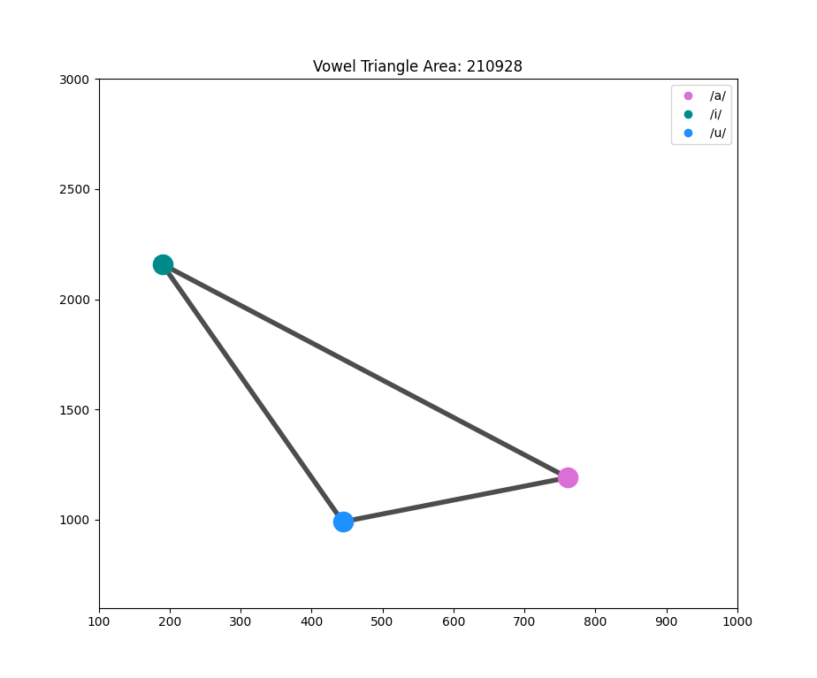

# Vowel Triangle Area, Live Demo

## Description

This repository contains a Python script that performs real-time formant frequency analysis and live plots the formant frequencies of corner vowels (`/a/`, `/i/`, and `/u/`) using the first two formant frequencies as axes.



## Requirements

To run the script, you'll need the following:

- Linux (tested on Ubuntu 20.04)
- Praat (for formant estimation)
- Python (version 3.9 or higher)
- Required Python packages (specified in `requirements.txt`)
- praat-fromants-python module [link](https://github.com/mwv/praat_formants_python.git)

## Installation

1. Clone this repository to your local machine or download the ZIP file.
2. Open a terminal or command prompt and navigate to the repository's directory.
3. Install the required Python packages using the following command:

```bash
./setup.sh

```

## Usage

To run the script and perform real-time formant frequency analysis:

> Make sure you have a microphone connected to your computer.
> Run the following script:

```bash
./demo.sh
```

- The script will start recording audio from your microphone and perform formant frequency analysis in real-time.

- The formant frequencies of the corner vowels (/a/, /i/, and /u/) will be calculated and plotted live using the first two formant frequencies as axes.

- The script will continue to run until you press `Ctrl+C` to stop it.

## Miscellaneous

Problems with PyAudio? Try the following:

```bash
sudo apt install python3-pyaudio
```

- refer to [PyAudio](https://pypi.org/project/PyAudio/) for more details.
